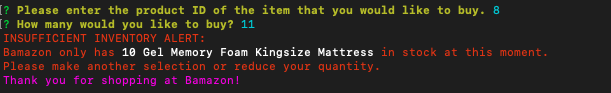

# mysql-amazon

Customer View:

* The app should start by prompting users with two messages.

* The first should ask them the ID of the product they would like to buy.
The second message should ask how many units of the product they would like to buy.

* Once the customer has placed the order, your application should check if your store has enough of the product to meet the customer's request.

* If not, the app should log a phrase like Insufficient quantity!, and then prevent the order from going through.

Initial table with full inventory:

First purchase:

Updated inventory in table:

Showing insufficient inventory when you order more than is in stock:

